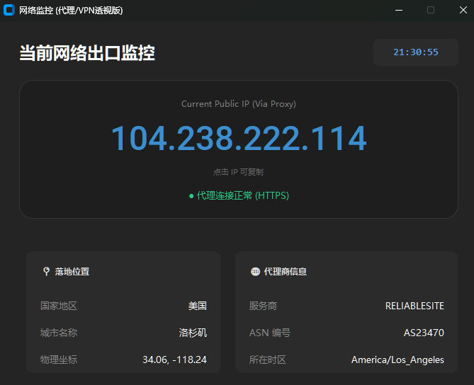

# 🌐 本地实时获取当前网络的公网IP-无缓存-支持代理模式-自动刷新

[](https://www.python.org/)
[](LICENSE)
[]()
[](https://github.com/TomSchimansky/CustomTkinter)

> **一个现代化、高颜值的本地网络出口监控工具。**
> 主打功能：代理透视、本地数据库解析、4K 高分屏显示。

---

## 📸 界面预览



---

## 📖 项目简介

**Network Monitor Pro** 是一个基于 Python `CustomTkinter` 开发的桌面端网络监控工具。

与传统的 IP 查询网页不同，本项目旨在解决“**开了代理不知道自己 IP 到底在哪**”以及“**网页查询有缓存不准确**”的痛点。它通过 HTTP/HTTPS 请求穿透您的代理服务器（Clash, v2ray 等），结合 **本地 MaxMind 离线数据库**，实现毫秒级的 IP 归属地、运营商 (ISP) 及 ASN 信息查询。

### ✨ 核心亮点

* **📺 4K 高清适配**：底层调用 Windows API 强制开启 High-DPI 支持，字体在 2K/4K 屏幕上锐利清晰，告别模糊。
* **🕵️ 代理透视**：支持读取系统代理或指定端口，精准检测 VPN/代理后的 **真实落地 IP**。
* **🚀 极速本地库**：内置 GeoLite2 (City & ASN) 数据库引擎，查询不依赖第三方 API 接口，保护隐私且无频率限制。
* **🎨 现代 UI**：基于暗黑模式的卡片式设计，自带实时刷新倒计时和动态状态指示灯。
* **📋 一键复制**：点击 IP 地址区域即可自动复制到剪贴板。
* **📦 单文件运行**：提供 PyInstaller 打包脚本，可生成不依赖 Python 环境的独立 `.exe` 文件。

---

## 🛠️ 安装与使用

### 1. ⚡ 快速开始 (安装)
请确保您的环境中已安装 Python 3.8+。复制以下命令一键完成代码下载与依赖安装：

```bash
# 1. 克隆仓库
git clone [https://github.com/你的用户名/NetworkMonitor.git](https://github.com/你的用户名/NetworkMonitor.git)

配置数据库 (⚠️ 非常重要)
由于 MaxMind 许可协议限制，本项目 不包含 .mmdb 数据库文件，您需要手动下载并放入项目根目录：

下载 GeoLite2-City.mmdb 和 GeoLite2-ASN.mmdb。

官方地址：MaxMind 官网

替代方案：在 GitHub 搜索关键字 "GeoLite2-City.mmdb download"

将这两个文件放入项目根目录下。

注意：文件名必须完全一致，分别为 GeoLite2-City.mmdb 和 GeoLite2-ASN.mmdb。

